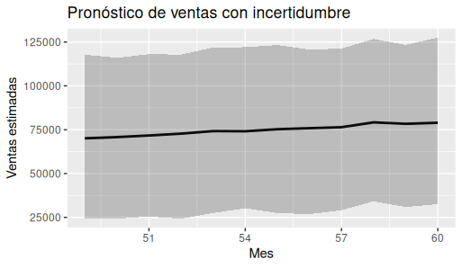
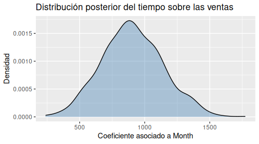

## 17.1 Introducción

Imagina que dos analistas presentan exactamente el mismo modelo de pronóstico de ventas.

El primero concluye:

> "Las ventas del próximo trimestre serán de **120 000** dólares."

El segundo dice:

> "Nuestro modelo considera más plausibles ventas cercanas a **120 000 dólares**, aunque valores entre **110 000 y 130 000 dólares** también son perfectamente compatibles con la información disponible."

Ambos utilizaron el mismo conjunto de datos.

Ambos ajustaron exactamente el mismo modelo.

Ambos obtuvieron la misma distribución posterior.

Sin embargo, la impresión que dejan es completamente distinta.

El primer analista transmite una sensación de precisión absoluta.

El segundo comunica una realidad mucho más cercana al funcionamiento del mundo: toda predicción está rodeada de incertidumbre.

Esa diferencia puede parecer únicamente una cuestión de estilo, pero en realidad cambia la forma en que otras personas toman decisiones.

Un gerente que escucha una cifra única puede interpretar que el futuro ya está determinado. En cambio, cuando conoce el rango de escenarios plausibles puede prepararse para distintas posibilidades, evaluar riesgos y diseñar planes alternativos.

A lo largo de este libro hemos insistido en una idea fundamental:

> Los modelos no producen certezas; producen escenarios plausibles basados en la información disponible.

Comunicar esos escenarios con honestidad es tan importante como construir el modelo que los generó.

En este capítulo no aprenderemos nuevos modelos estadísticos. En cambio, desarrollaremos una habilidad igual de valiosa: explicar resultados probabilísticos de forma clara, útil y responsable.

## 17.2 Comunicar probabilidades en lugar de certezas

Cuando una persona escucha el resultado de un análisis suele formular una pregunta muy sencilla:

> **Entonces... ¿qué va a pasar?**

Es una pregunta natural, pero difícil de responder con absoluta precisión.

Los datos describen el pasado y ayudan a construir escenarios para el futuro, pero no eliminan la incertidumbre.

Por eso, uno de los mayores cambios que propone el enfoque bayesiano consiste en reemplazar afirmaciones categóricas por afirmaciones probabilísticas.

Comparemos algunos ejemplos.

| Comunicación categórica             | Comunicación probabilística                                                                                |
| ----------------------------------- | ---------------------------------------------------------------------------------------------------------- |
| Las ventas serán de $120 000.       | El modelo considera más plausibles ventas cercanas a $120 000.                                             |
| Este cliente abandonará la empresa. | Este cliente presenta una alta probabilidad de abandono.                                                   |
| La campaña funcionará.              | Los resultados sugieren una probabilidad elevada de éxito, aunque existen escenarios menos favorables.     |
| Este tratamiento será efectivo.     | Los datos indican que el tratamiento tiene una alta probabilidad de ser efectivo para pacientes similares. |

Las diferencias parecen pequeñas, pero modifican profundamente la interpretación.

La primera columna presenta el futuro como si fuera conocido.

La segunda reconoce que existen distintos escenarios compatibles con la evidencia.

Ese cambio de lenguaje no hace que el análisis sea más débil.

Lo hace más honesto.

### Pensar en distribuciones, no en números

Durante todo el libro hemos trabajado con distribuciones posteriores.

¿Por qué?

Porque un único número rara vez resume toda la información relevante.

Cuando observamos una distribución estamos viendo algo mucho más rico:

- cuál es el resultado más plausible;
- cuánto varían los escenarios posibles;
- qué tan incierta es la predicción;
- cuáles son los valores extremos pero todavía posibles.

En otras palabras, la distribución cuenta una historia mucho más completa que una cifra aislada.

## 17.3 El poder de las visualizaciones honestas

Una buena visualización no elimina la incertidumbre.

La hace visible.

En los capítulos anteriores utilizamos varios gráficos para representar distribuciones posteriores, intervalos plausibles y predicciones.

En este capítulo veremos cómo esos mismos gráficos ayudan a comunicar resultados de forma más transparente.

### Mostrar intervalos plausibles

Supongamos que ya disponemos de un modelo bayesiano para pronosticar ventas.

En lugar de mostrar únicamente la predicción promedio, podemos representar también el intervalo plausible.

{fig-alt="Ventas estimadas" width="65%"}

El código incorpora un elemento que el lector ya conoce: `geom_ribbon()`.

La línea central representa el valor más plausible según el modelo.

La banda sombreada muestra el rango donde también podrían encontrarse las ventas futuras.

Ese pequeño cambio transforma completamente el mensaje del gráfico.

Ya no observamos una única trayectoria inevitable.

Observamos un conjunto de escenarios compatibles con la información disponible.

### Distribuciones posteriores

Otro gráfico familiar consiste en representar directamente la distribución posterior de un parámetro.

{fig-alt="Ventas estimadas" width="65%"}

Este gráfico comunica inmediatamente dos aspectos:

- dónde se concentran los valores más plausibles;
- cuánta incertidumbre existe alrededor del parámetro.

No necesitamos explicar algoritmos de muestreo ni detalles técnicos sobre MCMC.

La propia forma de la distribución transmite la información esencial.

### Menos decoración, más claridad

Cuando comunicamos resultados probabilísticos conviene evitar gráficos recargados.

Con frecuencia, un gráfico sencillo comunica mucho mejor que uno lleno de elementos decorativos.

Antes de añadir colores, etiquetas o múltiples capas de información, conviene preguntarse:

> ¿Este elemento ayuda a comprender la incertidumbre o simplemente hace el gráfico más llamativo?

## 17.4 Contar la historia correcta

Un gráfico nunca habla por sí solo.

Necesita contexto.

Supongamos que un gerente observa la siguiente figura.

La predicción media de ventas aumenta ligeramente durante los próximos meses.

¿Significa eso que la empresa debe duplicar inmediatamente su producción?

No necesariamente.

Quizá el intervalo plausible también aumentó considerablemente.

Quizá existe una probabilidad importante de que las ventas permanezcan prácticamente estables.

Quizá el crecimiento esperado sea demasiado pequeño para justificar una inversión costosa.

El gráfico muestra datos.

El analista debe explicar qué significan esos datos para la decisión que se va a tomar.

### Del dato a la decisión

Una forma útil de estructurar la comunicación consiste en responder cuatro preguntas.

1. ¿Qué observamos?
2. ¿Qué tan seguros estamos?
3. ¿Qué escenarios alternativos siguen siendo plausibles?
4. ¿Qué implicaciones tiene esto para la decisión?

Responder estas preguntas obliga a conectar el análisis con el problema de negocio.

Ese puente entre evidencia y decisión es el verdadero valor del analista.

## 17.5 Errores frecuentes al comunicar resultados

Incluso un excelente modelo puede conducir a malas decisiones si se comunica de forma inadecuada.

Algunos errores aparecen con mucha frecuencia.

### Ocultar la incertidumbre

Presentar únicamente un valor promedio hace creer que ese resultado ocurrirá con certeza.

Siempre que sea posible, acompañe la estimación con un intervalo plausible o una distribución.

### Exagerar diferencias pequeñas

Dos estrategias pueden diferir muy poco y, sin embargo, una presentación exagerada puede hacer parecer que existe una gran ventaja.

Antes de destacar una diferencia conviene preguntarse:

> ¿La incertidumbre permite afirmar que esa diferencia es realmente importante?

### Confundir probabilidad con certeza

Una probabilidad del 80 % no significa que el evento ocurrirá inevitablemente.

Significa que todavía existe un 20 % de escenarios donde el resultado será diferente.

### Utilizar lenguaje excesivamente categórico

Expresiones como:

- "demostramos";
- "garantizamos";
- "ocurrirá";
- "es seguro";

deberían utilizarse con mucha cautela.

En la mayoría de los problemas reales resulta más apropiado utilizar expresiones como:

- "la evidencia sugiere";
- "es plausible";
- "los datos indican";
- "el modelo considera probable".

Ese pequeño cambio refleja mejor la naturaleza incierta de los fenómenos que estudiamos.

## 17.6 Pensar en quien toma la decisión

Los análisis no se realizan para impresionar a otros analistas.

Se realizan para ayudar a alguien a decidir.

Esa persona puede ser un gerente comercial, un responsable de marketing, un director financiero, un médico o cualquier profesional que deba elegir entre varias alternativas.

Cada uno necesita respuestas diferentes.

Un gerente de ventas probablemente quiera conocer el rango de ventas esperado para planificar inventarios.

Un equipo de marketing puede interesarse por la probabilidad de éxito de una campaña.

Un médico quizá necesite estimar el riesgo de complicaciones antes de recomendar un tratamiento.

Aunque las decisiones cambien, la necesidad es la misma: comprender la incertidumbre.

Por eso, una buena comunicación no consiste únicamente en explicar el modelo.

Consiste en traducir los resultados a un lenguaje que facilite la decisión.

El objetivo final no es demostrar que el modelo es sofisticado.

Es ayudar a otra persona a actuar con mayor confianza, sabiendo también cuáles son las limitaciones del análisis.

## 17.7 Reflexión bayesiana

A lo largo de este libro hemos aprendido que los modelos bayesianos describen un conjunto de escenarios plausibles y no un único futuro inevitable.

Esa filosofía también debe reflejarse en la forma de comunicar los resultados.

Mostrar incertidumbre no disminuye la calidad del análisis.

Al contrario, demuestra que comprendemos la naturaleza limitada de nuestros datos y que respetamos la complejidad del mundo real.

Cuando comunicamos intervalos plausibles, distribuciones posteriores o probabilidades, no estamos añadiendo dudas innecesarias.

Estamos ofreciendo una imagen más completa de la evidencia disponible.

En ese sentido, comunicar incertidumbre forma parte del propio análisis.

No es un detalle de presentación, sino una expresión del pensamiento probabilístico que ha guiado todo este libro.

## 17.8 Ejercicios

### Ejercicio 1. Reescribiendo conclusiones

Reescriba las siguientes afirmaciones utilizando un lenguaje probabilístico.

1. Las ventas serán de $95 000.
2. Este cliente cancelará el servicio.
3. La campaña será exitosa.
4.- El nuevo precio aumentará las ventas.

### Ejercicio 2. Mejorando un gráfico

Observe uno de los gráficos de predicción construidos en capítulos anteriores.

¿Qué información adicional podría incorporarse para comunicar mejor la incertidumbre?

### Ejercicio 3. Detectando falsas certezas

Lea las siguientes frases e identifique cuáles transmiten una falsa sensación de certeza.

- La estrategia A funcionará mejor.
- Existe una alta probabilidad de que la estrategia A obtenga mejores resultados.
- El proyecto tendrá éxito.
- Los datos sugieren un escenario favorable para el proyecto.

Explique su respuesta.

### Ejercicio 4. Escribiendo para un gerente

Imagine que un gerente le pregunta si debe aumentar el inventario para el próximo trimestre.

Utilizando uno de los modelos desarrollados en el libro, redacte un informe breve (entre 150 y 200 palabras) que:

- describa el escenario más plausible;
- mencione la incertidumbre existente;
- explique qué riesgos deberían considerarse antes de tomar la decisión;
- evite afirmaciones categóricas.

### Ejercicio 5. Reflexión personal

Piense en alguna noticia, informe o presentación que haya visto recientemente.

¿Se comunicaban los resultados como certezas absolutas o como escenarios probabilísticos?

¿Qué efecto cree que tuvo esa forma de comunicar la información sobre quienes debían tomar decisiones?