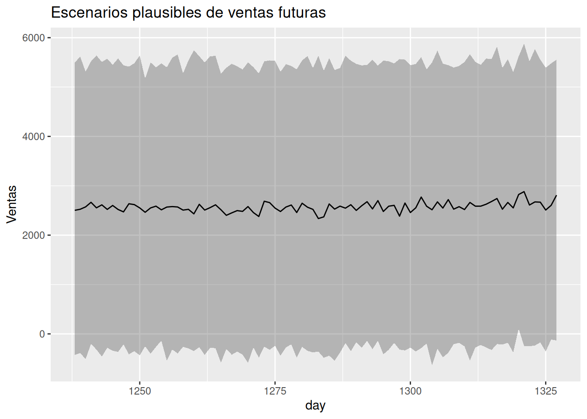

## Introducción

### ¿Qué significa realmente analizar datos?

Cuando comenzamos este libro, probablemente tenías una idea bastante clara de lo que esperabas encontrar. Tal vez querías aprender a crear modelos estadísticos, hacer mejores gráficos o utilizar R para analizar datos. Quizá imaginabas que, al finalizar, serías capaz de responder preguntas de negocio con mayor precisión.

Es muy probable que también esperaras algo más profundo, aunque no lo expresaras con esas palabras: encontrar respuestas.

Después de todo, esa es una expectativa natural. Cuando buscamos datos, solemos hacerlo porque existe una decisión difícil por delante. Queremos reducir la incertidumbre y sentir que contamos con información suficiente para elegir el mejor camino.

Un gerente desea saber cuánto venderá el próximo trimestre antes de decidir cuánto inventario comprar.

Un responsable de marketing quiere conocer qué campaña tiene mayor probabilidad de generar nuevos clientes.

Un equipo de atención al cliente intenta identificar qué usuarios presentan mayor riesgo de abandonar la empresa para actuar antes de que eso ocurra.

En todos estos casos, el análisis de datos parece prometer una respuesta. Sin embargo, a lo largo de este libro hemos descubierto que esa promesa no es del todo correcta.

Los datos rara vez responden nuestras preguntas con un simple "sí" o "no". En cambio, nos ayudan a comprender qué escenarios son más plausibles, cuáles son menos probables y cuánta incertidumbre sigue existiendo alrededor de cada posibilidad.

Ese pequeño cambio de perspectiva transforma por completo la manera de analizar información.

Al principio del libro hablamos de variabilidad. Aprendimos que dos observaciones nunca son exactamente iguales y que incluso procesos aparentemente estables presentan fluctuaciones naturales. Esa variabilidad no era un defecto de los datos; era una característica del mundo real.

Más adelante descubrimos que la probabilidad no consiste únicamente en calcular porcentajes. También representa una forma de expresar qué tan compatibles son los datos con distintos escenarios posibles. En lugar de buscar una única respuesta correcta, comenzamos a trabajar con distribuciones de resultados plausibles.

Cuando introdujimos el enfoque bayesiano, apareció una idea todavía más poderosa: nuestras conclusiones pueden cambiar cuando obtenemos nueva evidencia. Las creencias dejan de ser posiciones rígidas para convertirse en hipótesis que evolucionan con la información disponible.

Finalmente, utilizamos modelos para organizar esa información y apoyar decisiones reales. Ya fuera estimando ventas futuras, evaluando el riesgo de pérdida de clientes o interpretando campañas de marketing, el objetivo nunca fue adivinar el futuro con exactitud. El objetivo siempre fue comprender mejor la incertidumbre.

Si existe una diferencia entre la persona que abrió este libro y la que ahora está leyendo este último capítulo, probablemente no sea que conoce más funciones de R o que puede construir modelos ligeramente más sofisticados.

La diferencia más importante es otra.

Ahora sabes que analizar datos no significa encontrar certezas.

Significa aprender a formular mejores preguntas, interpretar la evidencia con humildad y tomar decisiones aun cuando la incertidumbre nunca desaparezca por completo.

Esa forma de pensar resulta útil mucho más allá del análisis de datos. También influye en cómo evaluamos información, cómo cambiamos de opinión cuando aparecen nuevas evidencias y cómo reconocemos que, en muchas ocasiones, las mejores decisiones no son aquellas que garantizan el éxito, sino aquellas que fueron tomadas considerando honestamente la información disponible en ese momento.

Ese ha sido, desde el principio, el verdadero propósito de este libro.

No enseñarte a eliminar la incertidumbre.

Enseñarte a pensar mejor dentro de ella.

## Mirar hacia atrás

Llegados a este punto, resulta tentador resumir todo lo que hemos estudiado capítulo por capítulo. Sin embargo, ese no sería el mejor cierre. Más que recordar cada técnica o cada función utilizada en R, vale la pena detenernos en las cuatro ideas que dieron sentido a todo el recorrido.

No son cuatro temas independientes. Son cuatro maneras de mirar un mismo problema: cómo tomar mejores decisiones cuando el futuro nunca está completamente bajo nuestro control.

## Aprendimos a convivir con la variabilidad

Uno de los primeros descubrimientos del libro fue que los datos nunca son perfectamente ordenados.

Las ventas cambian de un mes a otro.

{fig-alt="Ventas estimadas" width="65%"}

Sin embargo, no todos los meses se comportan exactamente igual. Hay meses que las ventas pueden aumentar 1500 dólares, otros meses las ventas pueden aumentar sólo 500 dólares, pero puede ser que lo más común sea que cada mes las ventas aumenten cerca de 900 dólares

Las campañas de marketing producen resultados distintos incluso cuando parecen similares.

Los tratamientos médicos generan respuestas diferentes entre pacientes.

Durante mucho tiempo, muchas personas interpretan esa variabilidad como un problema que debe eliminarse. Si un resultado cambia, pensamos que algo salió mal.

Sin embargo, la realidad funciona de otra manera.

La variabilidad no es un error del análisis.

Es una propiedad natural de casi todos los fenómenos que intentamos comprender.

Aceptar esa idea cambia profundamente nuestra relación con los datos. En lugar de frustrarnos porque los resultados fluctúan, empezamos a preguntarnos cuánto fluctúan, por qué lo hacen y qué información útil puede esconderse detrás de esas diferencias.

Esa fue la primera lección del libro: antes de buscar patrones, debemos aceptar que el mundo real es inherentemente variable.

## Aprendimos a pensar probabilísticamente

Una vez aceptada la variabilidad, apareció una pregunta inevitable.

Si el futuro nunca es completamente predecible, ¿cómo podemos tomar decisiones?

La respuesta fue aprender a pensar en términos de probabilidades.

Durante todo el libro dejamos de formular preguntas como:

"¿Qué ocurrirá?"

y empezamos a formular otras mucho más útiles:

"¿Qué escenarios parecen más plausibles?"

"¿Qué tan probable es cada uno?"

"¿Cuánta incertidumbre sigue existiendo?"

Este cambio puede parecer pequeño, pero modifica profundamente la forma de interpretar los resultados.

Un pronóstico de ventas deja de ser un único número para convertirse en un conjunto de escenarios posibles.

La probabilidad de que un cliente abandone la empresa deja de verse como una etiqueta definitiva y pasa a interpretarse como un nivel de riesgo que puede ayudar a priorizar acciones.

Incluso una estimación aparentemente sencilla adquiere un significado diferente cuando entendemos que siempre existe un margen razonable de incertidumbre.

Pensar probabilísticamente no significa renunciar a tomar decisiones.

Significa reconocer que toda decisión importante implica evaluar escenarios, no certezas.

## Aprendimos a construir modelos útiles

En varios momentos del libro utilizamos regresiones lineales, regresiones logísticas, distribuciones posteriores y simulaciones.

Sería fácil pensar que el objetivo consistía en aprender esas técnicas.

En realidad, todas ellas fueron herramientas para lograr algo mucho más importante.

Cada modelo nos obligó a hacer explícitas nuestras preguntas.

¿Qué variables parecen estar relacionadas?

¿Qué información consideramos relevante?

¿Qué supuestos estamos aceptando?

¿Qué incertidumbre permanece después del análisis?

Poco a poco descubrimos que un buen modelo no es necesariamente el más complejo.

Es aquel que ayuda a comprender mejor un problema y facilita una conversación más informada entre las personas que deben tomar decisiones.

En varias ocasiones utilizamos modelos sencillos que explicaban suficientemente bien la situación analizada. Esa elección fue deliberada.

En la práctica profesional, un modelo comprensible suele generar mucho más valor que uno extremadamente sofisticado pero imposible de interpretar.

Después de todo, las decisiones las toman personas, no algoritmos.

## Aprendimos a decidir bajo incertidumbre

Quizá esta haya sido la enseñanza más importante de todo el libro.

Al comenzar, muchos lectores imaginan que el análisis de datos sirve para descubrir la respuesta correcta.

Con el paso de los capítulos vimos que la realidad es distinta.

Incluso después de realizar un buen análisis, todavía existen riesgos.

Todavía pueden ocurrir eventos inesperados.

Todavía es posible equivocarse.

Lejos de ser una limitación del análisis, esta situación refleja la naturaleza del mundo en que vivimos.

Las empresas toman decisiones sin conocer exactamente cómo evolucionará el mercado.

Los hospitales asignan recursos sin saber cuántos pacientes llegarán mañana.

Las organizaciones lanzan nuevos productos sin conocer con certeza cómo reaccionarán los consumidores.

Esperar información perfecta suele ser imposible.

Por eso, el verdadero valor del análisis consiste en reducir la incertidumbre lo suficiente para tomar decisiones mejor fundamentadas.

No elimina el riesgo.

Pero ayuda a comprenderlo.

No garantiza el éxito.

Pero permite actuar con mayor conocimiento de las posibilidades.

Y quizá esa sea una de las ideas más valiosas que puede aprender cualquier analista.

Los datos no sustituyen la responsabilidad de decidir.

La hacen más consciente.

## Una transformación que va más allá del análisis

Si observamos estas cuatro ideas en conjunto, aparece un patrón interesante.

Aprendimos que la variabilidad es normal.

Aprendimos a pensar en probabilidades.

Aprendimos a construir modelos que organizan nuestra comprensión del problema.

Y aprendimos que las decisiones siempre requieren convivir con cierto grado de incertidumbre.

Ninguna de estas ideas pertenece exclusivamente al análisis de datos.

También son útiles para dirigir una empresa, diseñar una política pública, atender un paciente, planificar un proyecto o incluso tomar decisiones personales.

En otras palabras, el recorrido de este libro no consistió únicamente en aprender nuevas herramientas.

Consistió en desarrollar una forma distinta de observar el mundo.

Y esa nueva forma de pensar será el punto de partida de la reflexión central del siguiente apartado: **¿qué papel cumplen realmente los modelos en nuestras decisiones?**

## Los modelos como herramientas para pensar

Hasta este punto del libro hemos hablado de distribuciones, probabilidades, intervalos plausibles, regresiones, pronósticos y riesgo. Aunque cada una de estas herramientas tiene características propias, todas comparten un mismo propósito.

Ayudarnos a pensar mejor.

Esa afirmación puede parecer demasiado sencilla, pero contiene una idea profunda. Con frecuencia se habla de los modelos estadísticos como si fueran máquinas capaces de producir respuestas objetivas e incuestionables. En la práctica, ocurre algo diferente.

Un modelo no toma decisiones.

Un modelo no conoce el negocio.

Un modelo no entiende las prioridades de una organización.

Un modelo tampoco sabe qué consecuencias tendría equivocarse.

Todo eso sigue dependiendo de las personas.

Entonces, ¿qué hace realmente un modelo?

La respuesta es que organiza nuestro razonamiento para que podamos analizar un problema de forma más clara, más explícita y más honesta.

En cierto sentido, un modelo se parece más a un buen mapa que a un oráculo.

Un mapa no reemplaza al viajero. Tampoco decide cuál es el mejor destino. Lo que hace es mostrar el terreno con suficiente claridad para que la persona pueda elegir el camino más conveniente.

Los modelos cumplen un papel muy parecido.

No nos dicen exactamente qué ocurrirá.

Nos ayudan a comprender mejor el escenario en el que debemos actuar.

## Organizar información que, de otro modo, sería difícil de interpretar

Imagina que una empresa registra sus ventas diarias durante cinco años.

La base de datos contiene miles de filas.

Cada venta está asociada con una fecha, una categoría de producto, una región, un descuento aplicado, el tipo de cliente y muchas otras variables.

Toda esa información es valiosa.

Pero también puede resultar abrumadora.

Observar únicamente la tabla de datos rara vez permite responder preguntas como:

- ¿Las ventas están creciendo?
- ¿Existe una tendencia?
- ¿Qué tan variable es el comportamiento mensual?
- ¿Qué podría ocurrir durante los próximos meses?

Los datos, por sí solos, contienen mucha información, pero poca estructura.

El modelo aporta precisamente esa estructura.

Resume relaciones, identifica patrones y organiza la evidencia para que podamos interpretarla con mayor facilidad.

Durante el libro utilizamos modelos relativamente sencillos. Sin embargo, incluso esos modelos fueron capaces de transformar miles de observaciones dispersas en una historia coherente sobre el comportamiento de las ventas, el riesgo de abandono de clientes o la efectividad de una campaña de marketing.

Ese es uno de los mayores aportes del análisis estadístico.

No consiste en fabricar información nueva.

Consiste en revelar patrones que ya estaban presentes, pero que resultaban difíciles de apreciar.

## Hacer visibles nuestros supuestos

Existe otra característica importante que suele pasar desapercibida.

Todo análisis incorpora supuestos.

Incluso cuando alguien afirma que está "dejando que los datos hablen por sí solos", en realidad ya tomó muchas decisiones antes de comenzar.

Eligió qué datos incluir.

Decidió qué variables analizar.

Seleccionó un período de tiempo.

Definió una pregunta.

Escogió una forma de resumir la información.

Los modelos tienen una ventaja importante: obligan a hacer explícitas muchas de esas decisiones.

Cuando ajustábamos una regresión lineal, estábamos suponiendo que existía una relación aproximada entre las variables.

Cuando construíamos una regresión logística, asumíamos que determinados factores podían modificar la probabilidad de que un cliente abandonara la empresa.

Cuando realizábamos un pronóstico, aceptábamos que el comportamiento pasado podía aportar información útil sobre el futuro.

Ninguno de esos supuestos garantiza que el modelo sea perfecto.

Pero al menos quedan sobre la mesa.

Y eso hace posible discutirlos, revisarlos y mejorarlos.

En muchas ocasiones, un modelo no fracasa porque esté mal programado.

Fracasa porque sus supuestos no representan adecuadamente la realidad que intenta describir.

Reconocer esa posibilidad forma parte del pensamiento probabilístico.

## Comparar escenarios, no adivinar el futuro

Uno de los cambios más importantes que introduce un modelo consiste en modificar la naturaleza de nuestras preguntas.

Antes del análisis solemos preguntar:

> "¿Qué va a ocurrir?"

Después de construir un modelo, empezamos a preguntar:

> "¿Qué escenarios parecen más plausibles?"

La diferencia puede parecer sutil, pero cambia completamente la conversación.

Recordemos el capítulo de pronósticos de ventas.

El objetivo nunca fue descubrir exactamente cuánto vendería la empresa el próximo mes.

Eso habría sido imposible.

Lo importante era comprender que existían varios escenarios razonables.

Un escenario optimista.

Uno moderado.

Y otro más conservador.

{fig-alt="Ventas estimadas" width="65%"}

Cada uno con una probabilidad distinta y con diferentes implicaciones para el negocio.

Gracias a esa información, un responsable de inventarios podía evaluar cuánto riesgo estaba dispuesto a asumir.

No necesitaba conocer el futuro con exactitud.

Necesitaba comprender suficientemente bien las alternativas disponibles.

Ese mismo principio apareció cuando analizamos el abandono de clientes.

La probabilidad estimada por la regresión logística nunca debía interpretarse como una sentencia definitiva.

Un cliente con una probabilidad del 80 % de abandonar la empresa todavía puede quedarse.

Otro con una probabilidad del 20 % puede marcharse inesperadamente.

El modelo no elimina la incertidumbre.

La organiza.

Y esa organización hace posible asignar recursos de manera más inteligente.

## Los modelos también mejoran nuestras preguntas

Al principio del libro muchas preguntas eran bastante generales.

"¿Qué producto vende más?"

"¿Qué cliente abandonará la empresa?"

"¿Cuál será la venta del próximo trimestre?"

Con el tiempo aprendimos que esas preguntas podían formularse de manera mucho más útil.

Por ejemplo:

- ¿Qué tan incierto es nuestro pronóstico?
- ¿Qué variables parecen estar más relacionadas con el resultado?
- ¿Qué información adicional reduciría la incertidumbre?
- ¿Qué decisión cambiaría si el escenario fuera distinto?

Observa que ninguna de estas preguntas busca eliminar la incertidumbre.

Todas intentan comprenderla mejor.

Esa es una consecuencia muy interesante del trabajo analítico.

Los modelos no solo producen respuestas.

También nos enseñan a formular preguntas más inteligentes.

Y, con frecuencia, una buena pregunta aporta más valor que una respuesta demasiado confiada.

## Una conversación entre datos y experiencia

En ocasiones se presenta una falsa oposición entre el análisis de datos y la experiencia profesional.

Como si fuera necesario elegir entre confiar en los modelos o confiar en las personas.

En realidad, las mejores decisiones suelen surgir cuando ambas fuentes de conocimiento trabajan juntas.

Pensemos nuevamente en el pronóstico de ventas.

Supongamos que el modelo predice un crecimiento moderado para el siguiente trimestre.

Al mismo tiempo, el equipo comercial informa que un competidor importante abandonará el mercado durante las próximas semanas.

Ese acontecimiento todavía no aparece en los datos históricos.

El modelo no puede anticiparlo.

Sin embargo, el conocimiento del negocio sí puede incorporarlo a la decisión final.

O imaginemos la situación inversa.

Un gerente está convencido de que las ventas aumentarán porque "siempre ocurre lo mismo".

Al revisar los datos, descubre que el patrón histórico no respalda esa percepción.

En ese caso, el modelo actúa como un mecanismo para cuestionar una intuición que quizá era demasiado optimista.

En ambos ejemplos ocurre exactamente lo mismo.

Ni el modelo reemplaza la experiencia.

Ni la experiencia vuelve innecesario el modelo.

Cada uno aporta información distinta.

La mejor decisión aparece cuando ambas perspectivas dialogan entre sí.

## Un buen modelo también sabe decir "no lo sé"

Puede parecer extraño, pero una de las mayores virtudes de un modelo bayesiano consiste en reconocer aquello que todavía no puede afirmar con suficiente confianza.

Durante el libro dedicamos mucho tiempo a interpretar distribuciones posteriores e intervalos plausibles.

A veces esos intervalos eran estrechos.

En otras ocasiones resultaban bastante amplios.

Lejos de ser una debilidad, esos intervalos nos recordaban algo muy importante:

La evidencia disponible tiene límites.

Cuando el modelo mostraba mucha incertidumbre, no estaba fallando.

Nos estaba diciendo que los datos aún no permitían distinguir claramente entre varios escenarios posibles.

Ese mensaje puede resultar menos satisfactorio que una respuesta categórica.

Pero también es mucho más honesto.

En el mundo real, admitir que todavía existe incertidumbre suele ser una señal de rigor, no de incompetencia.

## Reflexión bayesiana

Una de las ideas más poderosas del enfoque bayesiano nunca estuvo relacionada únicamente con las matemáticas.

Siempre estuvo relacionada con la humildad.

Cada distribución posterior que analizamos representaba una creencia actualizada después de observar nueva evidencia.

Nunca una verdad definitiva.

Ese mismo principio puede extenderse a nuestra manera de pensar.

Las mejores decisiones no provienen de aferrarnos a nuestras primeras conclusiones.

Provienen de estar dispuestos a revisarlas cuando aparece información nueva.

Los modelos nos ayudan precisamente en ese proceso.

No porque tengan siempre la razón.

Sino porque hacen visible aquello que sabemos, aquello que todavía ignoramos y aquello que podría cambiar mañana.

## La incertidumbre permanece

Después de construir un modelo, analizar los resultados e interpretar las probabilidades, todavía queda una pregunta importante.

¿Ahora sí conocemos el futuro?

La respuesta sigue siendo la misma que al comienzo del libro.

No.

Y eso no debería decepcionarnos.

De hecho, si un análisis nos hiciera creer que el futuro ya está completamente resuelto, probablemente deberíamos desconfiar de él.

La incertidumbre no desaparece porque hayamos utilizado mejores herramientas.

Permanece porque el mundo cambia constantemente.

Los mercados cambian.

Las personas cambian.

Las empresas cambian.

Nosotros mismos cambiamos.

Ningún modelo puede capturar por completo esa complejidad.

Y tampoco necesita hacerlo para resultar útil.

## El análisis reduce incertidumbre, no la elimina

Imaginemos nuevamente el problema del inventario.

Antes de analizar los datos, la empresa prácticamente desconoce cómo podrían comportarse las ventas durante los próximos meses.

Después del análisis, dispone de una distribución de escenarios plausibles.

Ahora entiende qué resultados parecen más probables y cuáles serían menos frecuentes.

¿Desapareció la incertidumbre?

No.

Pero disminuyó.

Pasamos de una incertidumbre casi absoluta a una incertidumbre mejor comprendida.

Esa diferencia puede parecer pequeña.

En realidad, es exactamente el valor que aporta el análisis.

No convierte el futuro en algo seguro.

Convierte lo desconocido en algo más manejable.

## El mundo siempre puede sorprendernos

Durante el libro utilizamos datos históricos para construir modelos.

Era una decisión razonable.

El pasado suele contener información útil.

Pero nunca contiene toda la información.

Puede aparecer una nueva regulación.

Puede cambiar la economía.

Puede surgir un competidor inesperado.

Puede modificarse el comportamiento de los consumidores.

Puede producirse un evento completamente extraordinario.

Nada de eso implica que el modelo estuviera "equivocado".

Simplemente significa que el mundo continuó evolucionando.

Los modelos describen la realidad disponible hasta el momento del análisis.

La realidad, mientras tanto, sigue escribiendo nuevos capítulos.

## La incertidumbre también protege contra el exceso de confianza

Aceptar que siempre existe incertidumbre produce un efecto muy valioso.

Nos vuelve más prudentes.

Cuando reconocemos que nuestros pronósticos tienen límites, solemos preparar planes alternativos.

Evaluamos riesgos.

Pensamos en escenarios.

Diseñamos estrategias de contingencia.

En cambio, cuando creemos que conocemos el futuro con absoluta certeza, dejamos de prepararnos para lo inesperado.

Paradójicamente, aceptar la incertidumbre suele conducir a decisiones mucho más sólidas.

Porque nos obliga a considerar posibilidades que de otro modo habríamos ignorado.

El criterio sigue siendo humano

## Llegamos al último tramo de este libro.

A lo largo de los capítulos anteriores aprendimos a explorar datos, construir modelos, interpretar probabilidades y comunicar incertidumbre. Sin embargo, todavía queda una idea por comprender. Quizá sea la más importante de todas.

Los modelos ayudan a decidir.

Pero no deciden.

Puede parecer una diferencia pequeña, aunque en realidad cambia por completo el papel del análisis de datos dentro de una organización.

Imaginemos que una empresa utiliza un modelo para estimar la probabilidad de que sus clientes abandonen el servicio. El modelo identifica a cien clientes con un riesgo elevado.

¿Qué debería hacer la empresa?

La respuesta no aparece en el modelo.

Podría ofrecer descuentos.

Podría llamar personalmente a esos clientes.

Podría mejorar el servicio.

Podría decidir no intervenir porque el costo de la campaña supera el beneficio esperado.

Todas esas decisiones son compatibles con el mismo análisis.

La diferencia no está en los datos.

Está en los objetivos de la organización, en sus recursos disponibles y en la estrategia que ha decidido seguir.

El análisis aporta evidencia.

La decisión incorpora, además, prioridades, restricciones y valores.

Ese ha sido un mensaje constante durante todo el libro.

Los modelos reducen la incertidumbre.

El criterio humano decide cómo actuar con esa incertidumbre.

## Dos personas pueden llegar a decisiones distintas

Supongamos ahora que dos directivos observan exactamente el mismo pronóstico de ventas para el próximo trimestre.

Ambos ven la misma distribución predictiva.

Ambos interpretan correctamente los intervalos plausibles.

Ambos entienden la incertidumbre del modelo.

Sin embargo, llegan a decisiones diferentes.

{fig-alt="Ventas estimadas" width="65%"}

La primera persona decide aumentar el inventario porque considera que perder ventas sería muy costoso.

La segunda prefiere mantener un inventario más pequeño porque teme acumular productos que después no se vendan.

¿Quién tiene razón?

Probablemente, ambos.

No porque las dos decisiones produzcan exactamente el mismo resultado, sino porque responden a prioridades distintas.

El análisis no determina cuánto riesgo estamos dispuestos a asumir.

Esa decisión pertenece a las personas.

En este punto resulta útil recordar que una buena decisión no siempre conduce al mejor resultado posible.

A veces tomamos una decisión razonable con la información disponible y, aun así, los acontecimientos evolucionan de manera desfavorable.

Del mismo modo, una decisión poco fundamentada puede terminar produciendo un buen resultado simplemente por azar.

Por eso nunca deberíamos evaluar una decisión únicamente por su desenlace.

También debemos preguntarnos si fue tomada considerando honestamente la evidencia disponible en ese momento.

## La humildad analítica

Existe una actitud que aparece una y otra vez entre los buenos analistas.

La humildad.

No significa desconfiar permanentemente de los modelos.

Significa reconocer sus límites.

Un analista humilde puede decir:

*"Con la información disponible, este escenario parece el más plausible."*

Pero también puede añadir:

*"Si obtenemos nueva evidencia, estaremos dispuestos a revisar esta conclusión."*

Lejos de transmitir inseguridad, esa forma de comunicar inspira confianza.

Las organizaciones necesitan personas capaces de reconocer cuándo existe suficiente evidencia para actuar y cuándo todavía conviene seguir investigando.

La humildad analítica también evita otro problema frecuente: el exceso de confianza.

Cuando un modelo produce un resultado muy preciso, puede resultar tentador pensar que la incertidumbre ha desaparecido.

Sin embargo, a lo largo del libro vimos repetidamente que incluso los mejores modelos conservan cierto grado de incertidumbre.

Aceptar ese hecho no debilita el análisis.

Lo fortalece.

Porque nos recuerda que siempre existe la posibilidad de aprender algo nuevo.

## Comunicar con honestidad también es parte del análisis

Una buena decisión depende tanto de un buen análisis como de una buena comunicación.

Imaginemos que presentamos un pronóstico diciendo:

*"Las ventas serán de 120 000 dólares."*

Ahora comparemos ese mensaje con otro ligeramente diferente:

*"El escenario más plausible se sitúa alrededor de los 120 000 dólares, aunque todavía existe una variabilidad razonable que conviene considerar antes de planificar el inventario."*

Ambas frases se basan en el mismo modelo.

Sin embargo, transmiten ideas muy distintas.

La primera sugiere una certeza que probablemente no existe.

La segunda comunica tanto la evidencia como la incertidumbre.

Durante este libro insistimos en que la comunicación no es un paso final del análisis.

Es parte del análisis.

Un modelo correctamente interpretado, pero mal comunicado, puede conducir a decisiones equivocadas.

En cambio, un análisis honesto ayuda a que todos comprendan no solo lo que muestran los datos, sino también aquello que todavía permanece incierto.

## El mejor análisis no reemplaza las conversaciones

En muchas ocasiones, el resultado más valioso de un análisis no es una cifra.

Es la conversación que genera.

Un pronóstico puede motivar al equipo financiero a revisar el presupuesto.

Una estimación de riesgo puede impulsar mejoras en la atención al cliente.

Una distribución posterior puede abrir un debate sobre nuevas oportunidades de negocio.

En todos esos casos, el modelo cumple una función muy importante.

No cierra la discusión.

La mejora.

Hace que las conversaciones sean más objetivas, más transparentes y mejor fundamentadas.

Quizá esa sea una de las formas más útiles de entender el papel del análisis de datos.

No como un mecanismo para terminar las discusiones.

Sino como una herramienta para que las discusiones sean mejores.

## Una última reflexión bayesiana

Desde los primeros capítulos apareció una idea sencilla que acompañó todo nuestro recorrido.

Las creencias pueden cambiar cuando aparece nueva evidencia.

Al principio la utilizamos para comprender el enfoque bayesiano.

Después la aplicamos a regresiones, pronósticos y probabilidades.

Pero, al llegar al final del libro, vale la pena observar que esa idea también puede extenderse mucho más allá de los modelos estadísticos.

Todos construimos explicaciones sobre el mundo.

Todos formulamos hipótesis.

Todos interpretamos la información desde nuestra experiencia.

El pensamiento bayesiano nos recuerda que cambiar de opinión frente a una buena evidencia no es una señal de debilidad.

Es una señal de aprendizaje.

Quizá ese sea uno de los hábitos intelectuales más valiosos que puede desarrollar cualquier analista.

Escuchar la evidencia.

Actualizar sus conclusiones.

Y mantener siempre la disposición para seguir aprendiendo.

En cierto modo, esa actitud representa el verdadero espíritu del análisis de datos.

No consiste en demostrar que siempre tenemos razón.

Consiste en acercarnos, poco a poco, a una mejor comprensión de la realidad.

## Cierre del libro

Cuando comenzamos este recorrido, probablemente los modelos parecían herramientas complejas.

Las distribuciones posteriores eran desconocidas.

Los intervalos plausibles resultaban extraños.

Las regresiones parecían técnicas reservadas para especialistas.

Hoy esas herramientas forman parte de tu manera de analizar problemas.

Pero espero que ese no sea el aprendizaje que recuerdes con más frecuencia.

Espero que, al cerrar este libro, recuerdes algo mucho más sencillo.

Que los datos rara vez hablan por sí solos.

Necesitan preguntas.

Necesitan contexto.

Necesitan interpretación.

Y, sobre todo, necesitan personas capaces de utilizarlos con criterio.

A lo largo de estas páginas vimos empresas que intentaban anticipar sus ventas, comprender el comportamiento de sus clientes y evaluar campañas de marketing. En todos esos ejemplos, los modelos fueron herramientas extraordinariamente útiles.

Pero nunca sustituyeron la experiencia de quienes conocían el negocio.

Nunca reemplazaron la responsabilidad de decidir.

Nunca eliminaron completamente la incertidumbre.

Y precisamente por eso fueron valiosos.

Porque ayudaron a tomar decisiones mejor informadas en un mundo donde la certeza absoluta simplemente no existe.

Vivimos rodeados de información.

Cada día aparecen nuevos datos, nuevas métricas y nuevos modelos.

Sin embargo, disponer de más información no garantiza tomar mejores decisiones.

Lo que realmente marca la diferencia es desarrollar la capacidad de interpretar esa información con prudencia, comunicarla con honestidad y actuar reconociendo tanto lo que sabemos como aquello que todavía ignoramos.

Ese es el tipo de pensamiento que el enfoque bayesiano intenta cultivar.

No promete respuestas perfectas.

Propone una manera más flexible, más transparente y más humana de aprender a partir de la evidencia.

Tal vez dentro de algunos años olvides el nombre de alguna función de R.

Quizá tengas que volver a consultar cómo ajustar un modelo o cómo construir un gráfico.

Eso es completamente normal.

Lo verdaderamente importante es que conserves la forma de pensar que has desarrollado durante este recorrido.

Que, frente a un problema complejo, recuerdes hacer preguntas antes de buscar respuestas.

Que distingas entre certeza y plausibilidad.

Que no confundas una probabilidad con una garantía.

Que estés dispuesto a cambiar de opinión cuando aparezca nueva evidencia.

Y que nunca pierdas de vista que detrás de cada modelo existen personas que deberán convivir con las consecuencias de las decisiones que tomen.

Si este libro logra acompañarte en ese camino, habrá cumplido su propósito.

Porque el mejor analista no es quien construye el modelo más sofisticado.

Ni quien realiza las predicciones más espectaculares.

Es quien ayuda a tomar mejores decisiones porque comprende mejor la incertidumbre.

Y así llegamos al final de este libro.

Pero no al final del aprendizaje.

Cada nuevo conjunto de datos, cada decisión difícil y cada pregunta sin una respuesta evidente serán una oportunidad para seguir practicando esta forma de pensar.

Los modelos continuarán evolucionando.

Las herramientas cambiarán.

Los algoritmos serán cada vez más potentes.

Sin embargo, habrá una idea que seguirá siendo tan valiosa como el primer día.

**La incertidumbre no es un problema que deba eliminarse.**

**Es una realidad que debemos aprender a interpretar.**

Y quizá esa sea la enseñanza más importante que puede llevarse un analista.

No aprender a predecir un mundo perfecto.

Sino aprender a tomar mejores decisiones en el mundo real.
