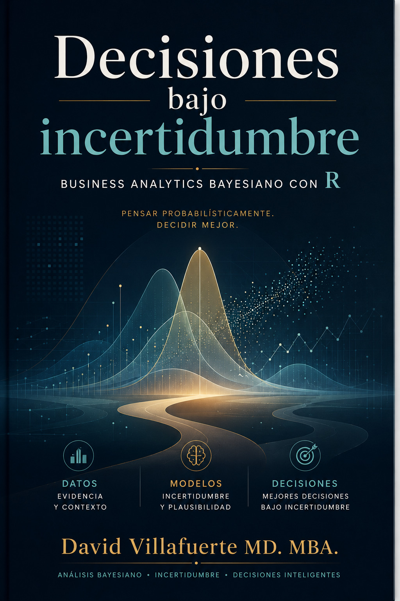

{fig-alt="Portada de la práctica del borrador del análisis de la tabla obesity latin" width="35%"}

## Bienvenido

Este es el sitio web del libro "Decisiones bajo incertidumbre", Este libro te enseñará a hacer análisis usando estadística bayesiana con R.

En este libro enconstrarás un manual muy práctico de habilidades para el análisis de datos bayesiano desde los temas más básicos como limpiar datos y crear gráficos, hasta crear modelos bayesianos en un contexto relacionado con la analítica de negocios usando algunas datasets de Kaggle: [Superstore Sales](https://www.kaggle.com/datasets/rohitsahoo/sales-forecasting), [Customer Churn](https://www.kaggle.com/datasets/blastchar/telco-customer-churn) y [Marketing Campaign](https://www.kaggle.com/datasets/rodsaldanha/arketing-campaign)

Este sitio web es y siempre será gratuito, bajo la licencia CC [BY-NC-ND 3.0](https://creativecommons.org/licenses/by-nc-nd/3.0/us/) .
