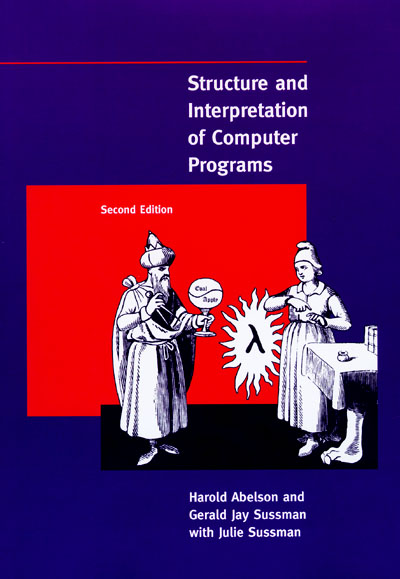

{fig-alt="Portada de la práctica del borrador del análisis de la tabla obesity latin" width="35%"}

## Bienvenido

Este es el sitio web del libro "SICP Accesible", Este libro te enseñará programación de paradigmas de programación en scheme.

En este libro enconstrarás un manual muy práctico de habilidades para entender paradigmas de programación en un contexto relacionado con la medicina y la administración de la salud usando algunos ejemplos de estas áreas.

Este sitio web es y siempre será gratuito, bajo la licencia CC [BY-NC-ND 3.0](https://creativecommons.org/licenses/by-nc-nd/3.0/us/) .
